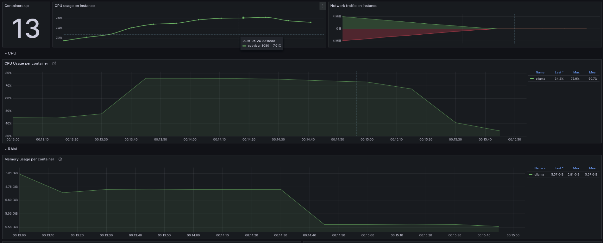
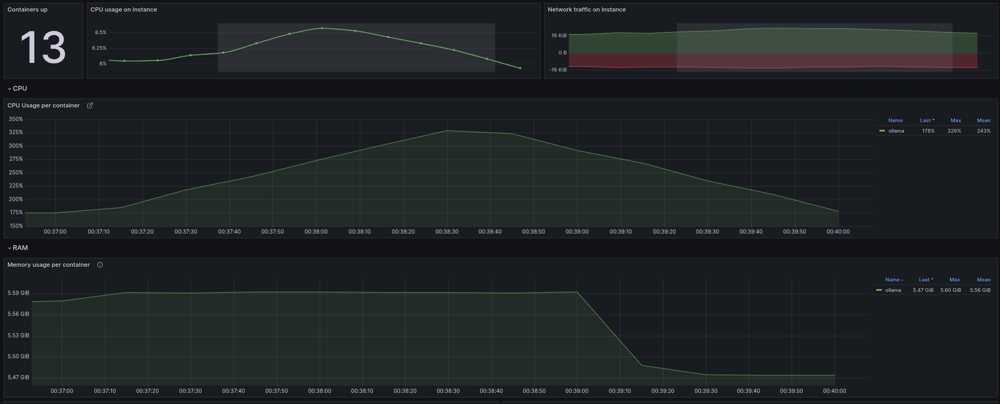
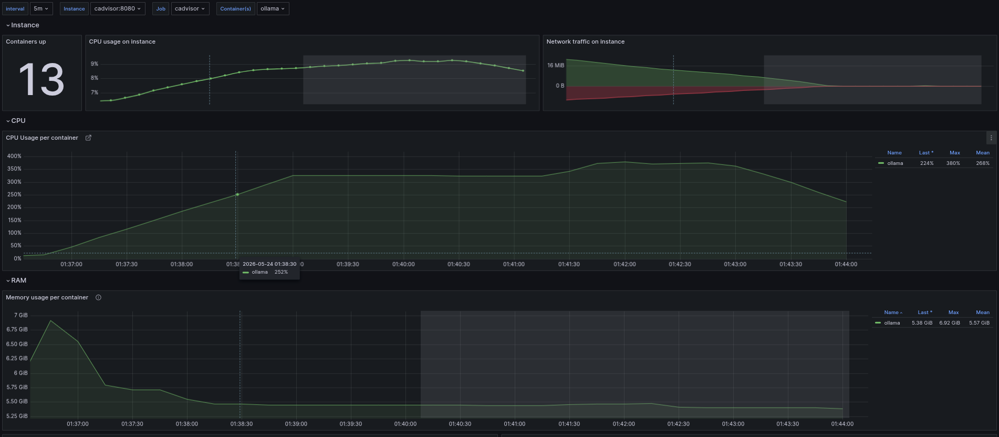
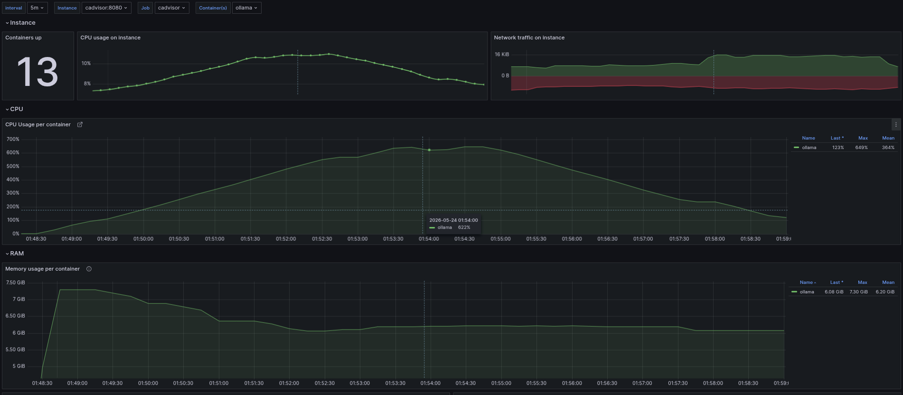

# Результаты бенчмарка

## Параметры стенда

- CPU: Intel(R) Core(TM) i7-11800H (16) @ 4.60 GHz
- RAM: 16GB
- GPU: NVIDIA GeForce RTX 3070 Mobile
- VRAM: 8GB

Замерялись системные метрики контейнера ollama, так как они наиболее значимы.

## Первичная настройка

- Consumer replicas: 3
- Context window size: 35000
- Max tokens in answer: 20000
- Temperature: 0.3
- Nucleus sampling: 0.9

Для запуска бенчмарка выполните команду:

```bash
docker compose -f docker-compose.monitoring.yml up -d
```

В графане (на http://localhost:3000) добавьте датасорс prometheus c адресом http://victoria-metrics:8428, в бенчмарке использовался [этот](https://grafana.com/grafana/dashboards/19724-y0nei-s-cadvisor-exporter/) дашборд.

## Запуск 1. Один запрос на qwen2.5-coder:1.5b

Параметры:

- Количество запросов: 1
- Файл: example1.py
- Модель: qwen2.5-coder:1.5b

Результаты:

- Время выполнения: 15.5 сек
- Корректность ответа: неудовлетворительно (0/10)
- VRAM: 2541 MiB
- RAM: 2 GiB

## Запуск 2. Один запрос на qwen2.5-coder:7b

Параметры:

- Количество запросов: 1
- Файл: example1.py
- Модель: qwen2.5-coder:7b

Результаты:

- Время выполнения: 16.1 сек
- Корректность ответа: (5/10)
- VRAM: 5656 MiB
- RAM: 5.74 GiB

https://snapshots.raintank.io/dashboard/snapshot/4CF0soYehR7fNPYDGXwMgbW1d2UxgqWd



## Запуск 3. Три запроса на qwen2.5-coder:7b

Параметры:

- Количество запросов: 3
- Файлы: example1.py, example2.py, example3.py (по одному на каждый запрос)
- Модель: qwen2.5-coder:7b

Результаты:

- Время выполнения: 90.5 сек
- Корректность ответа: (7/10)
- VRAM: 5660 MiB
- RAM: 5.60 GiB

https://snapshots.raintank.io/dashboard/snapshot/86LbYTbPHDGM2qbYrblLW29pcNTaznnV



## Запуск 4. Пять запросов при трёх воркерах на qwen2.5-coder:7b

Параметры:

- Количество запросов: 5
- Файлы: example1.py, example2.py, example3.py, example4.c, example5.c (по одному на каждый запрос)
- Модель: qwen2.5-coder:7b

Результаты:

- Время выполнения: 101.3 сек
- Корректность ответа: (7/10)
- VRAM: 5705 MiB
- RAM: 5.23 GiB

https://snapshots.raintank.io/dashboard/snapshot/MTT8VlgXJW3LV8QnZF0sqjqvoQMXHGuM


## Запуск 5. Пять файлов одним запросом на qwen2.5-coder:7b

Параметры:

- Количество запросов: 1
- Файлы: example1.py, example2.py, example3.py, example4.c, example5.c
- Модель: qwen2.5-coder:7b

Результаты:

- Время выполнения: 210.6 сек
- Корректность ответа: (7/10)
- VRAM: 5735 MiB
- RAM: 5.49 GiB

https://snapshots.raintank.io/dashboard/snapshot/2LPa4nVr6T2XAnXRJ2EHljLyF5QgAgJC


## Запуск 6. Три запроса на llama3.1:8b

Параметры:

- Количество запросов: 3
- Файлы: example1.py, example2.py, example3.py
- Модель: llama3.1:8b

Результаты:

- Время выполнения: 55.6 сек
- Корректность ответа: (8/10)
- VRAM: 5513 MiB
- RAM: 6.92 GiB

https://snapshots.raintank.io/dashboard/snapshot/H2MQAvNZgeLmkiQ4G5m1cQ5Re01D7chU




## Запуск 7. Один запрос на 5 файлов на llama3.1:8b

Параметры:

- Количество запросов: 1
- Файлы: example1.py, example2.py, example3.py, example4.c, example5.c
- Модель: llama3.1:8b

Результаты:

- Время выполнения: 392.6 сек
- Корректность ответа: (9/10)
- VRAM: 5571 MiB
- RAM: 7.30 GiB

https://snapshots.raintank.io/dashboard/snapshot/VCzfatXd4mawqqu346UR6mrRsYb9Mc9z



## Запуск 8. 3 запроса на Gemini 1.5 Pro

Параметры:

- Количество запросов: 3
- Файлы: example2.py, example4.c, example5.c
- Модель: llama3.1:8b

Результаты:

- Время выполнения: 392.6 сек
- Корректность ответа: (9/10)
- VRAM: 5571 MiB
- RAM: 7.30 GiB

## Итог

По рузультатам бенчмарка наиболее удачными оказались модедли qwen2.5-coder:7b и llama3.1:8b, но и требования к VRAM, RAM и CPU при их использовании были высоки. Система показала хорошее распаралеливание задач (обработки запросов с разных pr) за счёт асинхронной обработки запросов, но обработка нескольких файлов внутри одного pr занимает довольно много времени.